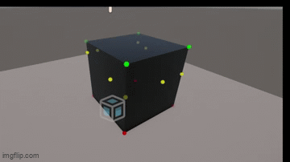

# Real-Time Mesh Physics Slicer (Unity)
> A lightweight, real-time procedural mesh slicing framework build in C# for Unity. The project cuts any 3D geometric shapre across a dynamic cutting plane and reconstructs clean, independant sub-meshes with proper topology and recalculated surface normals.
---

## Preview & Demo

*Demonstation of the dynamic mesh slicing, plane intersection and mesh seperation.
---

## Project Overview & Summary
The **Physics Slicer** is a procedural mesh manipulation system designed to slice a 3D object dynmaically during runtime. It uses vector geometry, plane-space calculations and vertex reconstruction without relying of pre-fractured assets.

### Key Features
* **No Precomputing:** Operates on the raw mesh data at runtime.
* **Local-Space Optimization:** Executes matrix transformations inside the local object space to minimize CPU/GPU load.
* **Dynamic Retriangulation:** Handles 1 to 3 triangle splitting while maintaining proper orders for lighting.
* **Modular Pipeline Architecture:** Stages split across multiple test scripts to ensure accuracy and progress at every stage.
---

## Table of Contents
* [Preview & Demo](#preview--demo)
* [Project Overview & Summary](#project-overview--summary)
* [Project Logs and Time Tracking](#project-logs-and-time-tracking)
* [Technical Breakdown & Architecture](#technical-breakdown--architecture)
  * [Stage 1: Local-Space Vertex Classification](#stage-1-local-space-vertex-classification-meshslicetestcs)
  * [Stage 2: Triangle Edge/Plane Intersection](#stage-2-triangle-edgeplane-intersection-meshslicetrianglescs)
  * [Stage 3: Dynamic Mesh Reconstruction](#stage-3-dynamic-mesh-reconstruction-meshslicereconstructioncs)
  * [Stage 4: Hole Filling & Surface Capping](#stage-4-hole-filling--surface-capping-meshslicefillingcs)
  * [Stage 5: UV Interpolation & Planar Projection Mapping](#stage-5-uv-interpolation--planar-projection-mapping-meshsliceuvcs)
  * [Stage 6: Dynamic Physics & Mass Distribution](#stage-6-dynamic-physics--mass-distribution-meshslicephysicscs)
  * [Stage 7: Burst Optimization & Job System Parallelization](#stage-7-burst-optimization--job-system-parallelization-meshsliceoptimisationcs)
* [Challenges & Optimization Hurdles](#challenges--optimization-hurdles)
* [Takeaways & Key Learnings](#takeaways--key-learnings)
* [How to Run & Usage](#how-to-run--usage)

## Project Logs and Time Tracking
Breakdown of the time invested during development
| Date | Time Window | Session Duration | Focus Area |
| --- | --- | --- | --- |
| **10th Sept 2026** | 18:25-20:54 | 2 hrs 29 mins | Plane dot product math & Dymanic mesh reconstruction (Stages 1-3) |
| **11th Sept 2026** | 14:30-16:14 & 18:00-19:25 | 3hrs 9 mins | Cap filling. Physics Rigidbody generation & Optimisation |
| **12th Sept 2026** | 10:00-11:41 | 1hr 41 mins | Extra Optimisation |
| **13th Sept 2026** | 9:55-11:25 | 1hr 30 mins | Getting rid of managed GC allocation & Burst Accelerated Cap Generation |
| **Future Updates/Improvements** | TBD | TBD | Optimise more. Main Thread Queue Draining, Fan triangulation cap & more manage memory allocations & ear clipping | 

* **Project Start Date:** September 10th 2026
* **Project Finish Date:** Setember 13th 2026
* **Current Total Time:** 8 hrs 49 mins Hours (Finished)
---

## Technical Breakdown & Architecture
Currently the pipeline operates on 3-stage modular workflow

### Stage 1: Local-Space Vertex Classification (MeshSliceTest.cs):
* **Objective:** Determine which side of the plane, every mesh vertex resides on.
* **Technical Overview:** Transforms the cutting plane's position and normal vector into the mesh's local space using `InverseTransformPoint` and `InverseTransformDirection`. Using the Dot Product equation:

$$d = (P_{\text{vertex}} - P_{\text{plane}}) \cdot \mathbf{N}_{\text{plane}}$$

* **Clasification Rule:**
    * $d \ge 0$: Vertex is infront or above the plane (Green Gizmo).
    * $d < 0$: Vertex is behind or below the plane (Red Gizmo).

## Stage 2: Triangle Edge/Plane Intersection (MeshSliceTriangles.cs):
* **Objective:** Detect where the triangle edges cross the cutting boundary and find the split coordinates.
* **Technical Overview:** Iterates over the mesh index (`triangles`). Tests each of the 3 edges per face using the signed distance product:

$$\text{isCut} = (distA \cdot distB < 0)$$

* **Linear Interpolation ($t$-value):** Calculates the exact intersection coordinates using distance ratio weighing:

$$t = \frac{|distA|}{|distA| + |distB|}$$

$$P_{\text{cut}} = \text{Vector3.Lerp}(VertexA, VertexB, t)$$

## Stage 3: Dynamic Mesh Reconstruction (MeshSliceReconstruction.cs):
* **Objective:** Split crossed triangles into valid mesh sub-components and rebuild a new `GameObject` instance.
* **Technical Overview:** * Uncut triangles pass directly to `AboveMesh` or `BelowMesh` buffers.
    * Intersected triangles split into 1 sub-triangle on the isolated vertex side and 2 sub-triangles (quadrilateral) on the paired vertex side
    * Preserves clockwise winding orders to surface the normals and lighting correctly
    * Recalculates the bounding boxes (`RecalculateBounds()` and surface normals (`RecalculateNormal()`))

## Stage 4: Hole Filling & Surface Capping (MeshSliceFilling.cs):
* **Objective:** Seal the open surface boundary created by the slicing operations
* **Technical Overview:**
    * **Centroid Computing:** Average the collected edge intersection points to generate a central vertex ($C$)
    * **2D Plane Projection:** Derive the local tangent and bitangent vectors using the cross product to conver the 3D edge points into 2D planar offsets
    * **Polar Angle Sorting:** Order the boundary vertices counter-clockwise using `Mathf.Atan2(y, x)`relative to the tangent plane
    * **Triangle Fan Reconstruction:** Triangulates the sorted points around the centroid, reversing the index winding orders between the top and bottom sub-meshes to ensure correctly facing normals

## Stage 5: UV Interpolation & Planar Projection Mapping (MeshSliceUV.cs):
* **Objective:** Preserve the original texture mapping acrossed the sliced edges and project dynamic 2D texture coordinates onto the newly capped faces
* **Technical Overview:**
    * **Edge UV Interpolation:** Evaluate the UV coordinates at the intersection points using dual linear interpolation (`Vector2.Lerp`) weighted by the scalar distance ratio $t$
    * **Planar Cap Projection:** Generate the capping UVs by projecting the 3D point offsets relative to the centroid onto the local orthogonal tangent axes ($\mathbf{U}, \,\mathbf{V}$):

    $$\text{UV}_{\text{cap}} = \left((P - C) \cdot \mathbf{U}, \, (P - C) \cdot \mathbf{V}\right)$$
    * **Surface Lighting:** Rebuild the mesh tangent vectors (`RecalculateTangents()`) to ensure directional lighting and normal maps across the sub-meshes

## Stage 6: Dynamic Physics & Mass Distribution (MeshSlicePhysics.cs):
* **Objective:** Instantiate physcial sliced mesh fragments with proportionate mass, centered tensors and convex colliders with a seperation impulse
* **Technical Overview:**
    * **Volume Analysis:** Evaluate the exact 3D closed mesh volume ($V$) using a tetrahedral signed triple-product summation:
    $$V = \left| \sum \frac{\mathbf{P}_1 \cdot (\mathbf{P}_2 \times \mathbf{P}_3)}{6} \right|$$
    * **Proprtional Mass Split:** Distribute the parent's mass to sub meshes relative to the volumetric ratio ($M_{\text{sub}} = M_{\text{total}} \cdot \frac{V_{\text{sub}}}{V_{\text{total}}}$)
    * **Center of Mass Alignment:** Shift the local vertex positions to align the local space origin with the centroid ($\bar{C}$), ensuring a stable rotation when calling `ResertInertiaTensor()`
    * **RigidBody State Transfer:** Generate a convex `MeshCollider` component which inherits the parent's linear and angular velocities while also applying a plane-normal impulse ($\mathbf{F}_{\text{impulse}}$) to seperate the pieces

## Stage 7: Burst Optimization & Job System Parallelization (MeshSliceOptimisation.cs):
* **Objective:** Offload high-volume distance calculations to multi-core worker threads using Unity's Job System and SIMD compilation
* **Technical Overview:**
    * **Parallel Job Execution:** Implements `IJobParallelFor` (`ClassifyVerticesJob`) to evaluate plane distance equations ($d = (P - P_0) \cdot \mathbf{N}$) across CPU threads
    * **Burst Compilation:** Decorate jobs with `[BurstCompile]`, Compiling the math into SIMD-accelerated machine code
    * **Unmanaged Allocation Management:** Allocates `NativeArray` buffers using `Allocator.TempJob` for cache-coherent contiguous memory access, disposing buffers after execution to prevent GC pressure:
    $$\text{OutDistances}[i] = (\text{Vertices}[i] - \text{LocalPlanePosition}) \cdot \text{LocalPlaneNormal}$$
---

## Challenges & Optimization Hurdles
### 1. Eliminating Garbage Collection (GC) Pressure
* **Problem:** The inital mesh splitting allocated array buffers (`List<Vector3>` and `Vector3[]`) every frame a cut occured. At runtime this would create hundreds of short-lived objects triggering frequent GC spikes, causing visual micro-stutters
* **Solution:** Refactored the vertex distance classification to use native unmanaged memory (`NativeArray<Vector3>` and `NativeArray<float>`) backed with `Allocator.TempJob`. These buffers are allocated in contiguous memory blocks and get immediately freed when `.Dispose()` is ran, keeping main-thread GC allocation zero

### 2. Burst-Compiling Generation
* **Problem:** The job system was inititally limited because the native mesh operations couldn't easily be passed into the Burst-compiled code due to reference constraints (Like the standard Mesh class)
* **Solution:** The raw geometric data structures were decoupled into unmanaged structs. Dedicated jobs (`ClassifyVerticesJob`) with `[BurstCompile(...)]` were written to execute vector SIMD operators across multiple worker threads

### 3. Maintaining Correct Centroids & Inertia Tensors
* **Problem:** Simply cutting the mesh and assigning a new collision geometry would cause rotated fragments to spin erratically off-center becuase Unity would calculate the inertia relative to the original object's local origin
* **Solution:** Centroid offset adjustments were implemented. Every sub-mesh would shift its vertex position relative to its own center, repositioning the origin before calling `ResetCenterOfMass()` and `ResetInteriaTensor()`

## Takeaways & Learnings
1. **Local Space Math to Minimise Computing:** Transforming the 3D plane into local mesh space (`InverseTransformPoint`) to avoid transforming thousands of vertices into world space every frame.
2. **Data-Oriented Design:** Transitioned heavy math loops from the traditional C# objects to flat and contiguous native arrays (`NativeArray<>`) which allowed hardware-level SIMD vector processing via the Burst compiler.
3. **Tetrahedral Integration:** Learned to compute the exact sub-mesh volume using signed triple-product summation ($\mathbf{P}_1 \cdot (\mathbf{P}_2 \times \mathbf{P}_3) / 6$), allowing for physical mass to scale proportionally to it's geometry.
4. **Planar Projection & Texture Mapping:** Generated dynamic and seamless UVs for capping faces by projecting the 3D point offsets onto local 2D orthonormal tangent axes ($\mathbf{U}, \mathbf{V}$) using scalar dot products.
5. **Memory Safety in Unity Jobs:** Gained some practical experience handelling unmananged memory, avoiding native memory leaks through disciplined allocation (`Allocator.TempJob`) and explicit disposal.
---

## How to Run & Usage

### Prerequisites
* **Unity Version:** Unity 6000.5.9f1 or newer
* **Required Packages:** Unity Mathematics, Burst, and the New Input System

### Quick Start Guide
1. Import `MeshSliceOptimisation.cs` and `MeshData.cs` into your Unity project's `Assets` folder.
2. Attach the optimisation script to any 3D game object containing a `MeshFilter`, `MeshRenderer` and `RigidBody`.
3. Create a 3D plane object into your scene to act as the cutting blade.
4. Drag the plane object into the `planeTransform` field on the `MeshSliceOptimsation` component in the Inspector.
5. Adjust the plane's height and rotation, using the inspectors gizmos to find the cut point.
5. Enter Play Mode and press the **[E]** key to slice the object.

### License & Usage
This project is open-source and free to use, adapt or build upon without any credit :)